# meidaisai2023_F

## 要件

### TRANSITION DIAGRAM

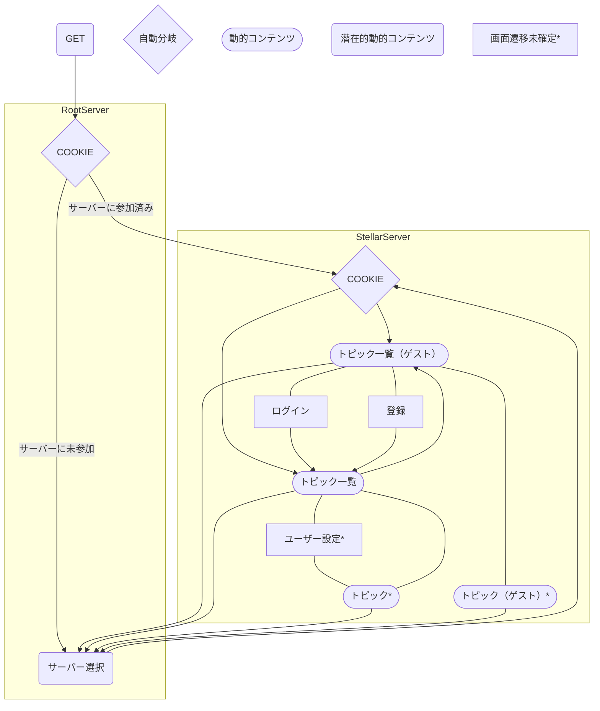

### SYSTEM FLOW

#### RootServer

##### initialize

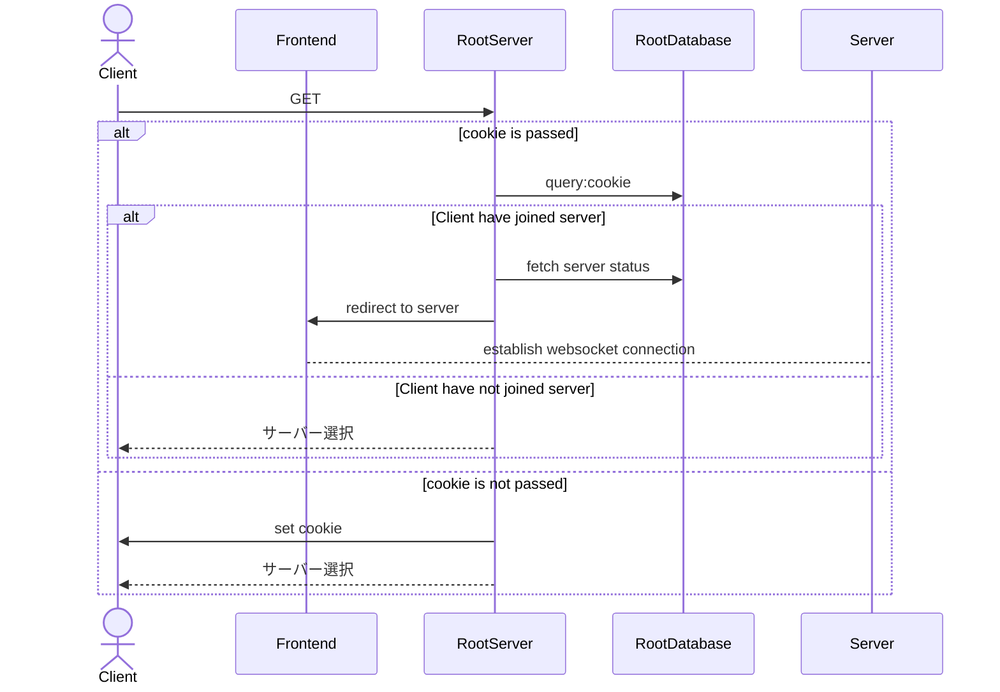

##### サーバー選択

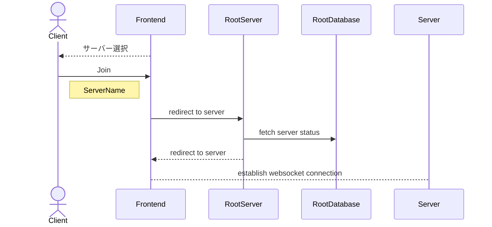

#### Server

##### Initialize

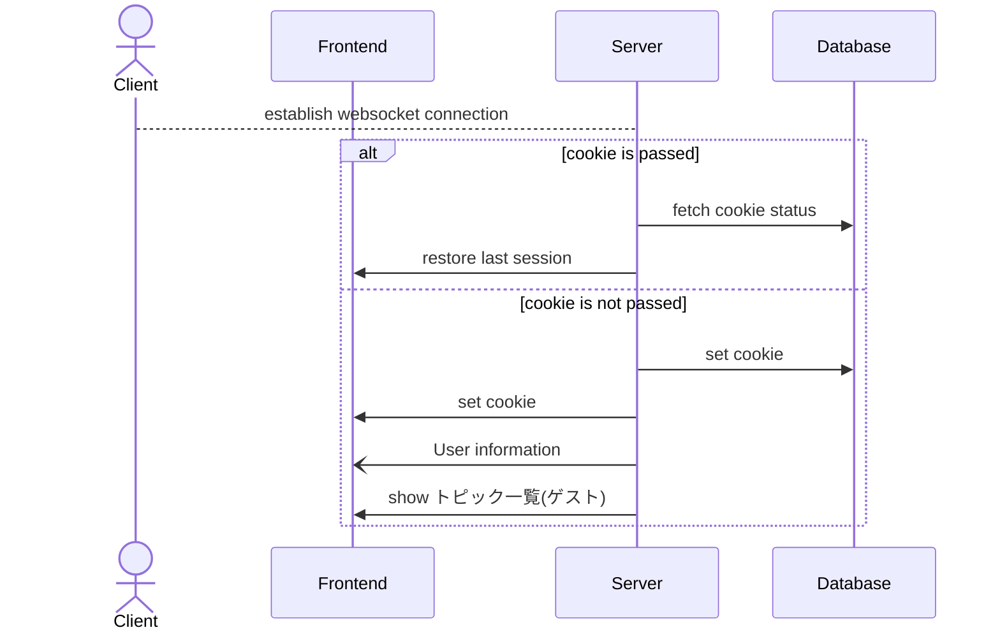

##### ログイン

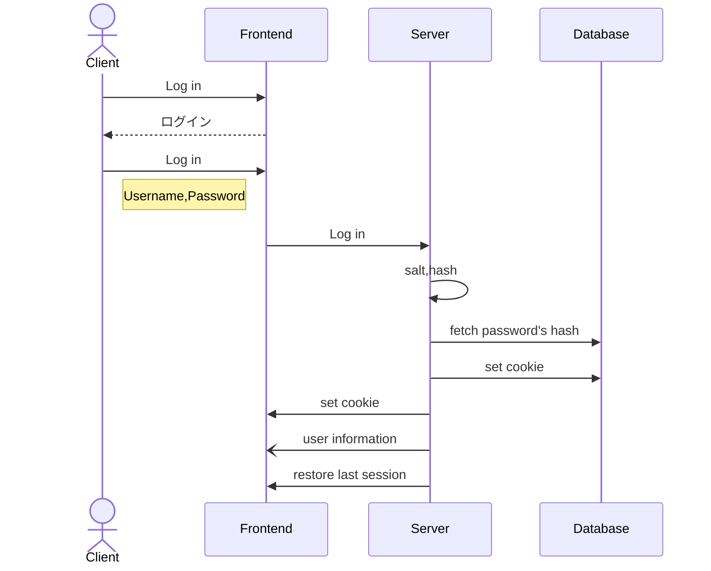

##### 登録

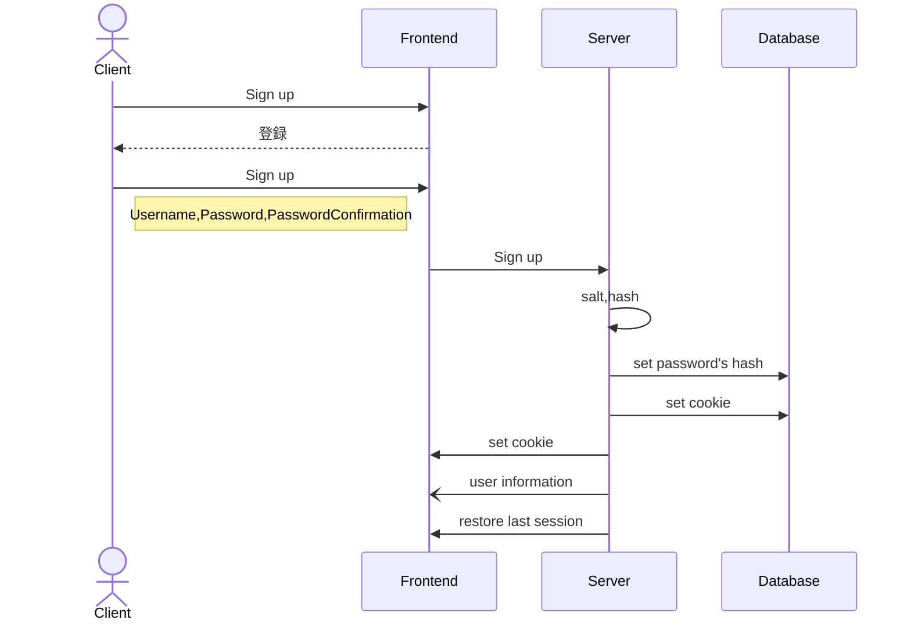

##### トピック一覧

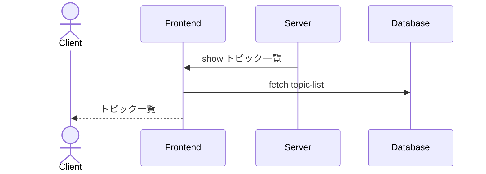

##### トピック

- unspecified

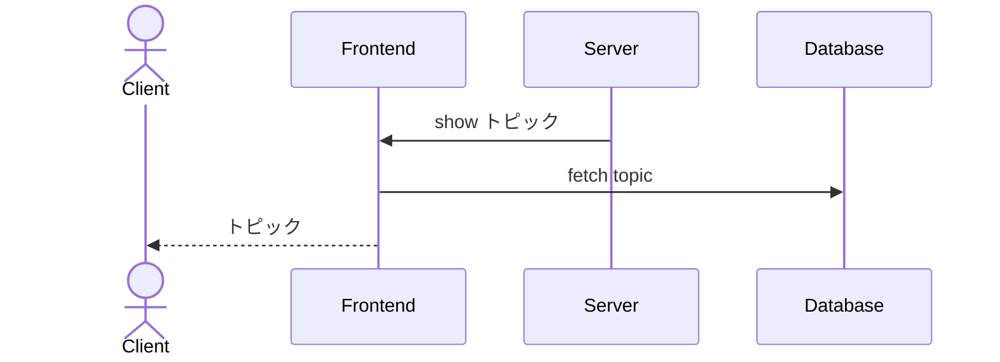

##### トピック一覧->トピック

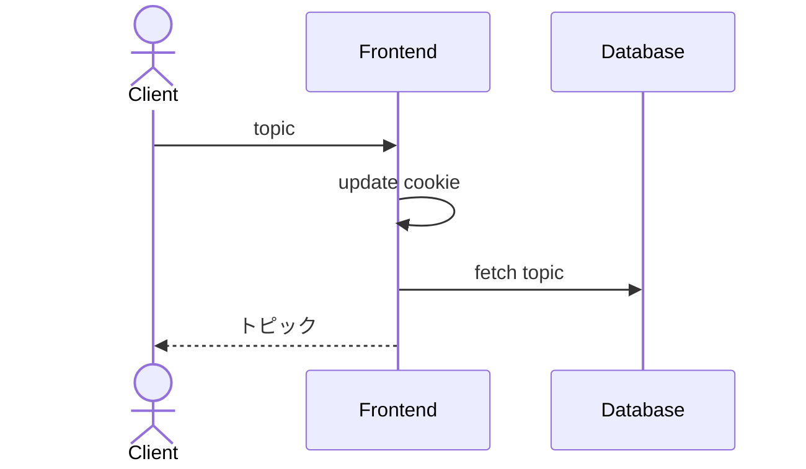

##### トピック->トピック一覧

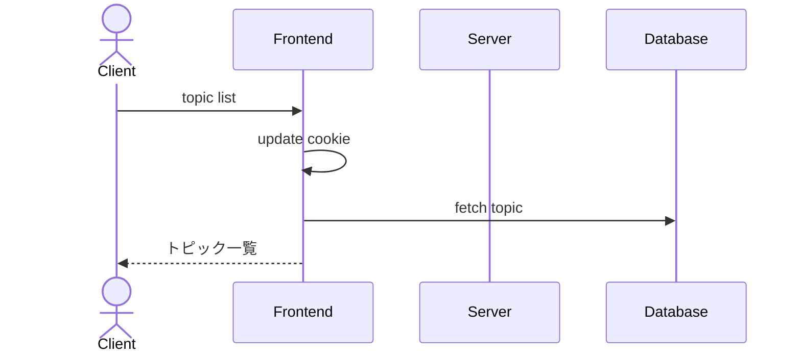

##### ユーザー設定

- unspecified

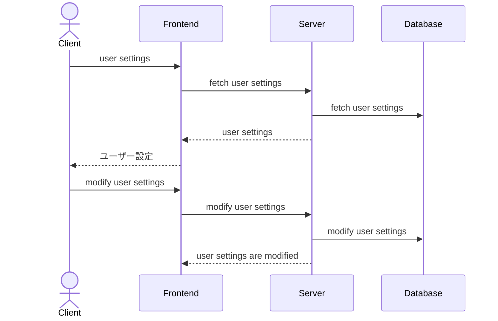

##### post

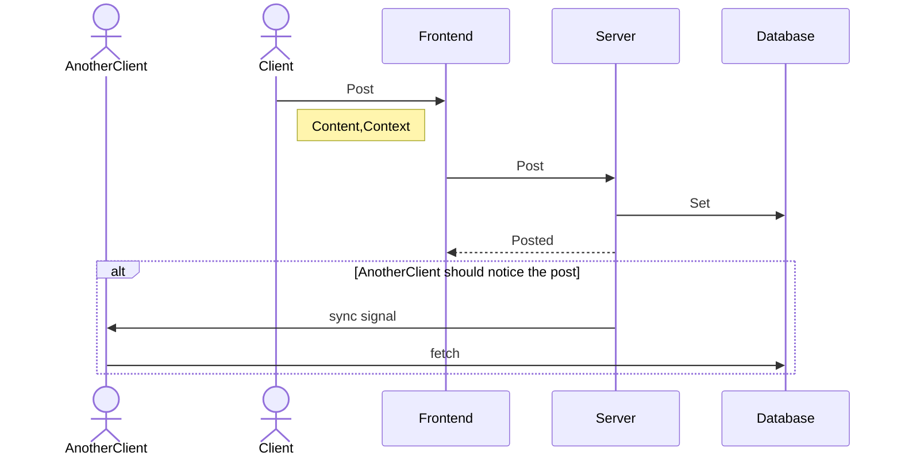

##### Log out

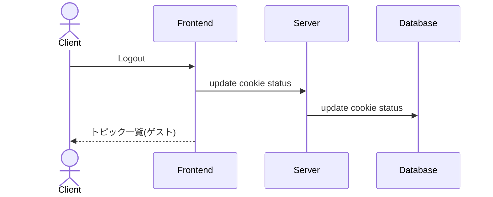

##### Leaving Server

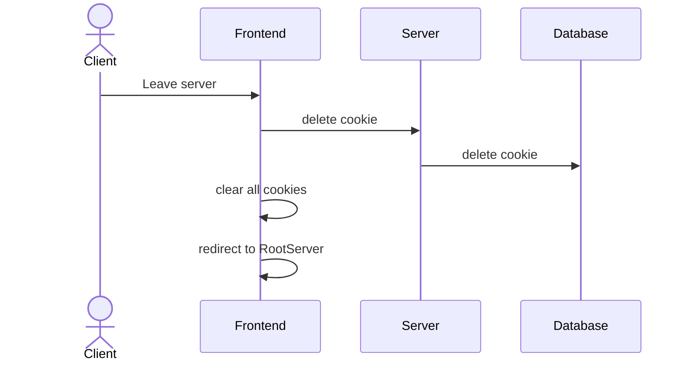

### DATA STRUCTURE

#### RootServer

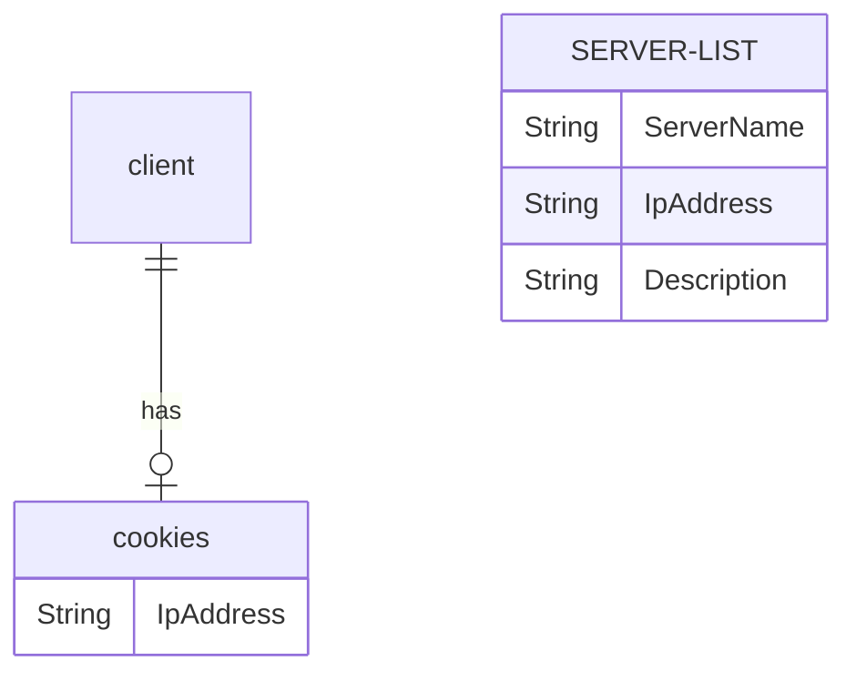

#### Server

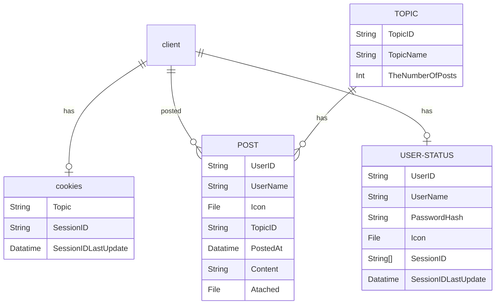
